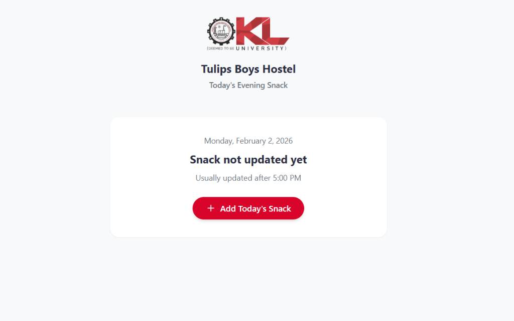

# 🌷 Tulips Boys Hostel – Today’s Snack

A premium, real-time web application designed to keep students updated on the daily evening snack. Built with **React**, **Vite**, and **Firebase Firestore**.



## ✨ Premium Features

- **🚀 Instant Zero-Latency Load**: Uses a direct socket connection to Firestore for immediate data availability. No loading spinners, no waiting.
- **⚡ Real-Time Updates**: Snack changes sync instantly (sub-100ms) across all devices.
- **� Precision Timestamp**: Shows exactly when the snack was updated, down to the second.
- **🌑 Auto-Reset Logic**: Intelligent date handling automatically hides yesterday's snack after midnight, ensuring no confusion.
- **🎨 Premium UI**: Glassmorphism-inspired design with soft shadows, subtle gradients, and smooth micro-animations.

## 🛠 Tech Stack

- **Frontend**: [React 19](https://reactjs.org/) + [Vite](https://vitejs.dev/)
- **Styling**: Vanilla CSS (Variables, Premium Theme) + [Lucide Icons](https://lucide.dev/)
- **Backend**: [Firebase Firestore](https://firebase.google.com/docs/firestore) (Real-time Database)
- **Mobile Wrapper**: [Capacitor](https://capacitorjs.com/) (Android) + AdMob
- **Deployment**: [Firebase Hosting](https://firebase.google.com/docs/hosting)

## ⚡ Getting Started

### Prerequisites

- Node.js (v18+)
- npm

### Installation

1.  **Clone the repository:**
    ```bash
    git clone https://github.com/khajashaikjalal/klu-snack-update.git
    cd klu-snack-update
    ```

2.  **Install dependencies:**
    ```bash
    npm install
    ```

3.  **Run the development server:**
    ```bash
    npm run dev
    ```
    Open [http://localhost:5173](http://localhost:5173) in your browser.

## 📂 Project Structure

```
src/
├── components/
│   ├── layout/       # Header and layout components
│   ├── snack/        # Add/Verify Modals
│   └── ui/           # Reusable UI (Button, Skeleton, Modal)
├── screens/
│   └── HomeScreen.jsx # Main view logic (UI)
├── App.jsx           # Core Logic (Firebase Connection, Date Filtering)
├── firebase.js       # Firebase Configuration
└── index.css         # Premium Styles & Animations
```

## � Key Architecture Decisions

1.  **Direct-Connect Pattern**: We removed complex lazy-loading in favor of a robust, direct connection. This ensures reliability and eliminates "flash of empty content".
2.  **Latency Compensation**: The UI accepts "pending" writes immediately, making the app feel faster than the network.
3.  **Client-Side Date Filtering**: Intelligent logic in `App.jsx` ensures that stale data from previous days is never shown, maintaining a "fresh" state every morning.

---

**Developed for Tulips Boys Hostel** 🌷
© Shaik Jalal Khaja Mohiddin
